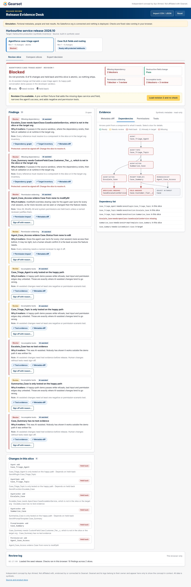
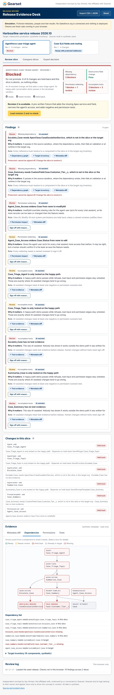
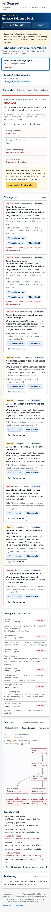
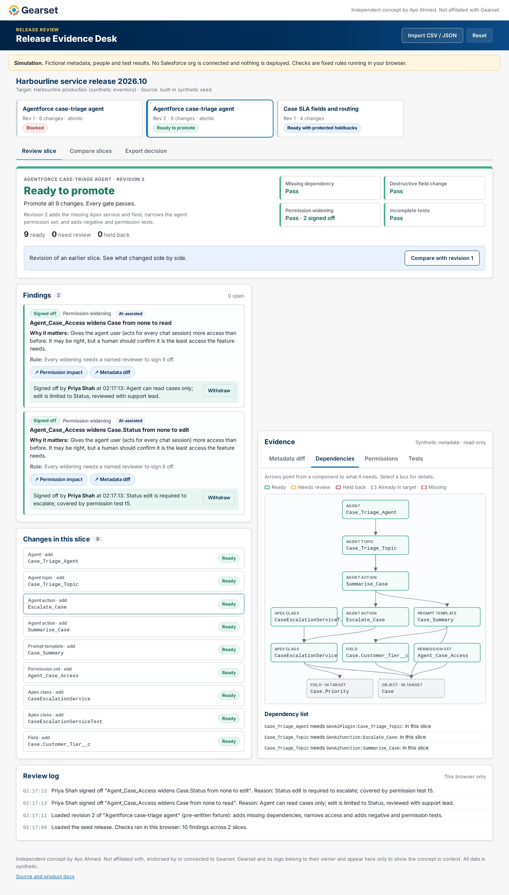
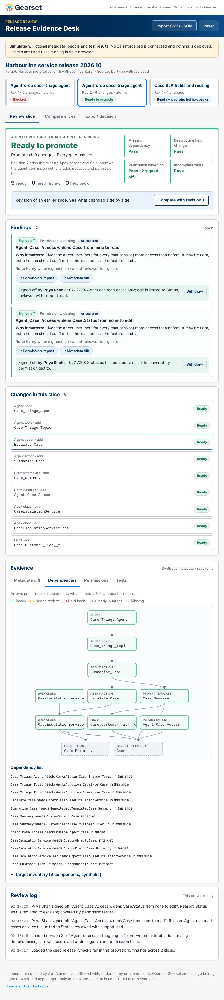
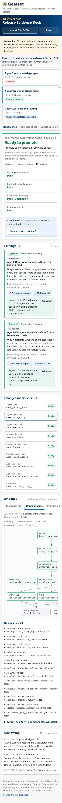

# Test plan and results

All results below are actual command output from 2026-10-07 on Node 20.18.0, Chromium (Playwright build 1134). No independent reviewer runs are recorded yet.

## 1. What is tested

| Layer | How | Covers |
|---|---|---|
| Rules engine | Vitest unit tests in `src/engine/checks.test.ts` | Every check, severity, overridability, cascade, decisions, determinism |
| Import | Same file | CSV quoting, line-numbered errors, missing headers, sample CSV/JSON, malformed JSON |
| Reports | Same file | Readiness denominators, gates, memo contents, CSV escaping |
| Types and lint | `tsc -b`, `eslint .` | Strict TypeScript, React hooks rules |
| Build | `npm run build` | Production bundle |
| Interaction | Scripted browser run against the production build at 1366, 820 and 390 px | The main flow end to end (below) |
| Visual | Screenshot of every step at each width, plus a horizontal-overflow probe | Readability, layout, no page overflow |

### Interaction flow (run at each width)

1. Intro → **Load seed release**
2. Agentforce rev 1 shows **Blocked**, 9 findings
3. Click **Dependency graph** evidence → missing Apex class highlighted
4. **Load revision 2 and re-check** → **Needs human review**, 2 findings
5. Sign off with a 5-character reason → refused with error message
6. Sign off both widenings with valid reasons → **Ready to promote**
7. **Compare slices** rev 1 vs rev 2
8. Case SLA slice → **Ready with protected holdbacks**
9. **Export decision** → decision memo downloads
10. Import panel → **Use sample CSV** → validate → load

## 2. Results

### Unit tests: `npm test`
```
 Test Files  1 passed (1)
      Tests  27 passed (27)
```

The 27 tests:

| Group | Test |
|---|---|
| Agentforce rev 1 | flags both missing dependencies as non-overridable blockers |
| | flags Modify All as a blocker and field edit as review |
| | flags untested AI-assisted components and happy-path-only tests |
| | is blocked and holds back every change (atomic, cascade) |
| | overriding everything overridable still cannot unblock missing dependencies |
| Agentforce rev 2 | has no blockers |
| | leaves exactly two permission sign-offs |
| | becomes ready once a reviewer signs off both widenings |
| | overrides recorded on v1 do not carry to v2 |
| Case SLA slice | holds back the populated field deletion and ships the rest |
| | a recorded override releases it |
| Rules | deleting a field another change still uses is a missing dependency |
| | Apex below 75% coverage is a non-overridable blocker |
| | a failing test is a blocker |
| | narrowing a type or shrinking length is destructive; zero records is review |
| | narrowing permissions is not flagged |
| | override validation |
| | is deterministic |
| Import | parses quoted CSV fields with commas, quotes and newlines |
| | imports the sample CSV and finds its issues |
| | reports row-level errors with line numbers and refuses to import |
| | rejects a CSV missing header columns |
| | imports the sample JSON and rejects malformed JSON |
| Reports | reports denominators and gates for v1 |
| | v2 after sign-off passes all gates and lists overrides in the memo |
| | memo for a blocked slice has no deploy list |
| | CSV report escapes cells |

### Type check and lint
```
tsc -b        exit 0
eslint .      exit 0
```

### Production build: `npm run build`
```
dist/assets/index-DPJSTkba.css     31.57 kB │ gzip:  6.23 kB
dist/assets/index-BIiBgyix.js     218.98 kB │ gzip: 68.98 kB
✓ built in 8.83s
```

### Interaction and visual run
All 30 steps (10 steps × 3 widths) reported `ok`. Page errors: `[]` at every width. The overflow probe compares document scroll width with viewport width and lists any element wider than the viewport (excluding intentionally scrollable code, table and graph containers); every step reported e.g. `{"sw":390,"iw":390,"bad":[]}`.

Screenshots in [`screenshots/`](screenshots/):

| Desktop 1366 | Tablet 820 | Phone 390 |
|---|---|---|
|  |  |  |
|  |  |  |

More: [graph evidence](screenshots/1366-03-evidence-graph.jpg), [compare](screenshots/1366-07-compare.jpg), [SLA holdback](screenshots/1366-08-sla-holdback.jpg), [export](screenshots/1366-09-export.jpg), [phone intro](screenshots/390-01-intro.jpg), [phone SLA](screenshots/390-08-sla-holdback.jpg).

## 3. Defects found and fixed during testing

| Found | Fix |
|---|---|
| Unit test expected all gates to fail on rev 1; the destructive gate correctly passes (no field changes) | Corrected the assertion to the three failing gates |
| Unused variable failed `tsc` | Removed |
| Two fast-refresh lint warnings (non-component exports) | Moved exports |
| Slice cards could not be found by accessible name in the browser run | Rebuilt the slice list as a `<ul>` of plain buttons |
| Dependency graph clipped its right-hand column at 1366 px | Narrowed nodes |
| Graph "missing" nodes showed no detail when clicked | Detail panel now handles missing components |
| Compare view reported narrowed permissions as "new" findings | Findings matched across revisions without the slice id |
| Long sample-format lines overflowed at 390 px; view tabs scrolled out of view | Wrapping and tighter tab padding on phones |
| Memo and log text said "change(s)", "slice(s)" | Proper singular and plural |
| Video run: second sign-off form was below the fold and was not completed | Recorder scrolls each control into view before clicking |

## 4. Not tested

- Real Salesforce metadata, large change sets (> 512 KB import refused by design), or browsers other than Chromium.
- Screen-reader output was not checked with an actual screen reader; semantics are native controls with labels.
- Usability with real release managers (see success criteria in [METRICS.md](METRICS.md)).
